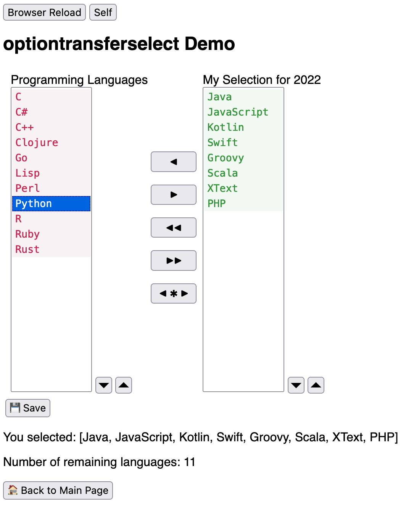

## Struts2 optiontransferselect Demo

This demonstrates the usage of the `<s:optiontransferselect.../>` Struts2 tag.

Official tag documentation: https://struts.apache.org/tag-developers/optiontransferselect-tag.html

Contrary to the original semantics - where only the _selected_ items are covered - it does supply the complete state of both sides to the underlying Struts action.
This is achieved by selecting all items prior to submitting the form.1)

After checking out the source you can start the project with the Maven goal `jetty:run` and then go to http://localhost:8080/struts2-demo/index.jsp.

This demo also contains...

* Support for double click.
* CSS tweaks for the buttons.
* A basic scope strategy for request and session scoped Struts beans.2)
* A simple interceptor to create a new session on a dedicated action.
* A (rather) up-to-date scaffold for Struts2 + jetty-maven-plugin.3)

1) Item selection reuses the `selectAllOptions` method of `struts/optiontransferselect.js`. To make the experience a little smoother for the user, the selection change is hidden by using the CSS attribute `transition-delay`.

2) The scope strategy is implemented with an `ActionProxyFactory` + `ActionProxy` pair. I found the idea on https://stackoverflow.com/a/17394920/16143492, so credits for that go to [Roman Chepeliev](https://www.linkedin.com/in/romanc) who posted it there.

3) I did not find a version of Jetty 11 that is compatible with Struts2, so I used the latest Jetty 10.

The demo was created of out Stackoverflow Question https://stackoverflow.com/questions/47342331.

The code does not have an explicit license, you can do whatever you want with it.

Questions, comments and pull requests are welcome.

